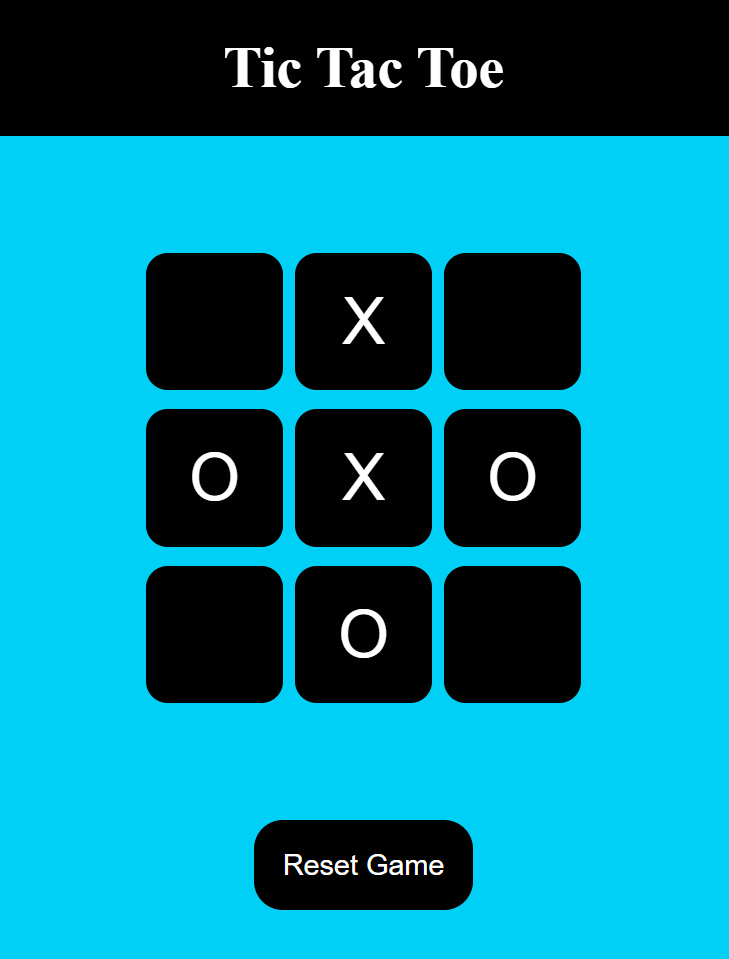

# Tic Tac Toe Game

Welcome to **Tic Tac Toe**! This is a simple two-player game that you can play in your web browser. The game features a 3x3 grid where players alternate placing their marks (either "X" or "O") until one of them wins or the game results in a draw.

## Features

- **Two-Player Gameplay**: Players alternate turns with "X" and "O".
- **Win Detection**: The game automatically detects when one player wins.
- **Draw Detection**: The game detects if all spots are filled and no one wins.
- **Reset Game**: Allows players to reset the game and play again.
- **New Game Button**: Starts a completely new game.

## Game Screenshot



## How to Play

1. **Clone the repository**:
   To get started, clone this repository to your local machine:
   ```bash
   git clone https://github.com/diwasbk/Tic-Tac-Toe.git

## Author

- [Diwas Bk](https://github.com/diwasbk)